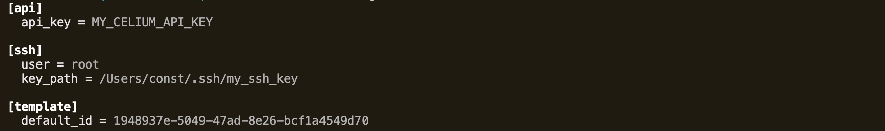
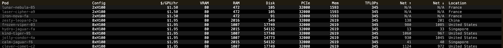
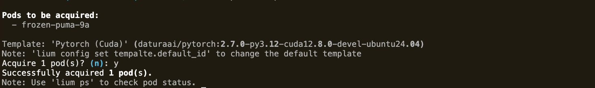
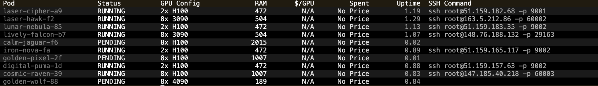
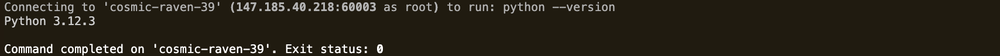
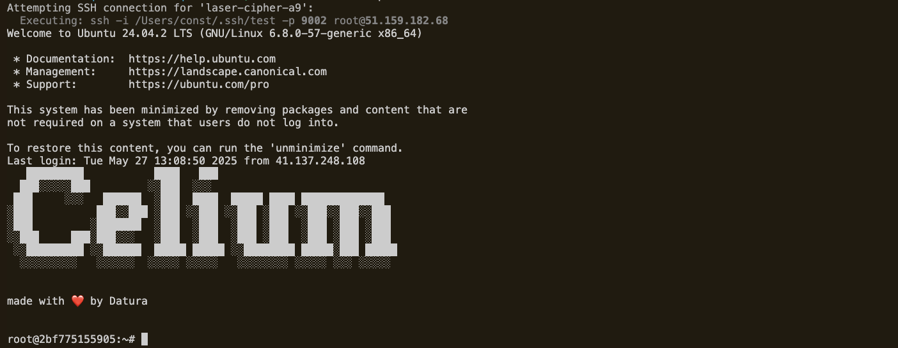
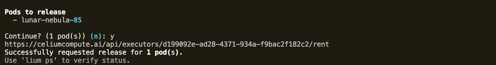

# 𓋼 Lium 

Manage [Celium](https://celiumcompute.ai) GPU pods from your terminal.

### 1. Install
Make sure you have uv and Python 3.10+ installed.
```bash
# Load env for lium
git clone git@github.com:unconst/lium.git && cd lium && uv venv && source .venv/bin/activate
# Install lium from source
uv pip install -e .
```

### 2. Configure
1. Generate your api key [here](https://celiumcompute.ai/api-keys)
2. Add funds to your account [here](https://celiumcompute.ai/billing)
```bash
# Set your celium API key.
lium config set api_key <YOUR_API_KEY_HERE> 
# Set path to your ssh private key
lium config set ssh.key_path <PATH_TO_YOUR_SSH_PRIVATE_KEY>
# Select your default template
lium config set template.default_id
# Show your config file in: ~/.lium/config.ini 
lium config show
```


## 3. Use

**1. Lium ls**
```bash
# List all available H100s for rental
lium ls H100
```


**2. Lium up**
```bash
# Rent pod with name "golden-pixel-2f"
lium up noble-matrix-a3

# Rent multiple pods
lium up golden-pixel-2f, calm-jaguar-f6`
```


**3. Lium ps**
```bash
# Shows all actively rented pods and their status
lium ps
```


**4. Lium Exec**
```bash
# Executes python --version command on cosmic-raven-39
lium exec cosmic-raven-39 "python --version"
```


**5. Lium SSH**
```bash
# Opens an ssh connection into laser-cipher-a9
lium ssh laser-cipher-a9
```


**6. Lium down**
```bash
# Release your rental on a pod golden-pixel-2f
lium down golden-pixel-2f

# Release all rentals without confirmation
lium down --all -y
```


## License

2025 Yuma Rao

Permission is hereby granted, free of charge, to any person obtaining a copy of this software and associated documentation files (the “Software”), to deal in the Software without restriction, including without limitation the rights to use, copy, modify, merge, publish, distribute, sublicense, and/or sell copies of the Software, and to permit persons to whom the Software is furnished to do so, subject to the following conditions:
The above copyright notice and this permission notice shall be included in all copies or substantial portions of the Software.
THE SOFTWARE IS PROVIDED “AS IS”, WITHOUT WARRANTY OF ANY KIND, EXPRESS OR IMPLIED, INCLUDING BUT NOT LIMITED TO THE WARRANTIES OF MERCHANTABILITY, FITNESS FOR A PARTICULAR PURPOSE AND NONINFRINGEMENT. IN NO EVENT SHALL THE AUTHORS OR COPYRIGHT HOLDERS BE LIABLE FOR ANY CLAIM, DAMAGES OR OTHER LIABILITY, WHETHER IN AN ACTION OF CONTRACT, TORT OR OTHERWISE, ARISING FROM, OUT OF OR IN CONNECTION WITH THE SOFTWARE OR THE USE OR OTHER DEALINGS IN THE SOFTWARE.
