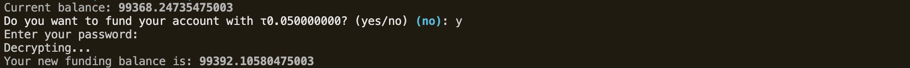
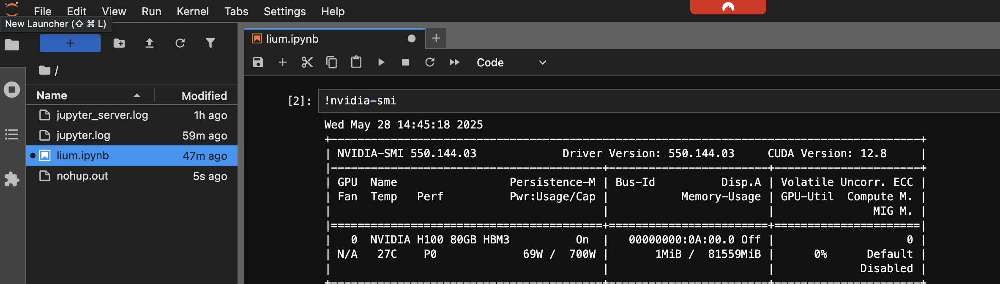
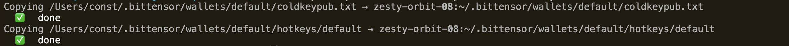
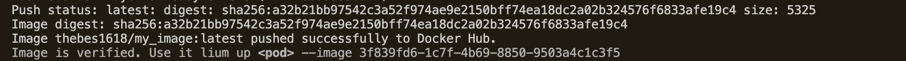

# 𓋼 Lium 

TAO + LIUM = GPU

Manage [Celium](https://celiumcompute.ai) GPU pods from your terminal.

---
### Install 
Make sure you have uv and Python 3.10+ installed.
```bash
# Install from source
git clone git@github.com:unconst/lium.git && cd lium && uv venv && source .venv/bin/activate && uv pip install -e .
```

### Use


---
`lium init` 
```bash
# Init lium config
lium init
> Please enter your Lium API key (See: https://celiumcompute.ai/api-keys): ...
> Please enter the path to your ssh private key (i.e.: ~/.ssh/id_rsa): ...
```


---
`lium fund` 
```bash
# Add 10 TAO to my current balance.
lium fund --wallet my_wallet_name --tao 10
```


---
`lium ls` 
```bash
# List all available H100s for rental
lium ls H100
```


---
`lium up`
```bash
# Rent pod with name "golden-pixel-2f"
lium up noble-matrix-a3

# Rent multiple pods
lium up golden-pixel-2f, calm-jaguar-f6`
```


---
`lium ps`
```bash
# Shows all actively rented pods and their status
lium ps
```


---
`lium exec`
```bash
# Executes python --version command on cosmic-raven-39
lium exec cosmic-raven-39 "python --version"

# Execute with environment variables
lium exec cosmic-raven-39 --env MY_VAR=value --env PATH=/custom:$PATH "python script.py"

# Multiple environment variables for a script
lium exec cosmic-raven-39 --env API_KEY=secret --env DEBUG=true --script scripts/app.sh
```


---
`lium exec --script`

```bash
# Starts a jupyter server via script in scripts/
lium exec cosmic-raven-39 --script scripts/jupyter.sh
```


---
`lium ssh`
```bash
# Opens an ssh connection into laser-cipher-a9
lium ssh laser-cipher-a9
```


---
`lium scp`
```bash
# Copy /Users/user/cat.py → zesty-orbit-08:~/cat.py
lium scp zesty-orbit-08 ~/cat.py

# Copy my default coldkey and hotkey
lium scp zesty-orbit-08 --coldkey default --hotkey default
```


---
`lium down`
```bash
# Release your rental on a pod golden-pixel-2f
lium down golden-pixel-2f

# Release all rentals without confirmation
lium down --all -y
```


---
`lium image`
```bash
# Build a custom image from local Dockerfile 
lium image my_image .
# Use it lium up <pod> --image 3f839fd6-1c7f-4b69-8850-9503a4c1c3f5

# Set this image as your default
lium config set template.default_id 3f839fd6-1c7f-4b69-8850-9503a4c1c3f5

# Or use it directly
lium up golden-pixel-2f --image 3f839fd6-1c7f-4b69-8850-9503a4c1c3f5
```

> NOTE: Dockerfiles **MUST** be based off of Datura offical images (i.e. FROM daturaai/dind:0.0.0 )

---
`lium config`
```bash
# Set your celium API key: (https://celiumcompute.ai/api-keys)
lium config set api.api_key <YOUR_API_KEY_HERE> 
# Set path to your ssh private key
lium config set ssh.key_path <PATH_TO_YOUR_SSH_PRIVATE_KEY>
# Select your default template
lium config set template.default_id 
# Show your config file in: ~/.lium/config.ini 
lium config show
```


---
## License

2025 Yuma Rao

Permission is hereby granted, free of charge, to any person obtaining a copy of this software and associated documentation files (the “Software”), to deal in the Software without restriction, including without limitation the rights to use, copy, modify, merge, publish, distribute, sublicense, and/or sell copies of the Software, and to permit persons to whom the Software is furnished to do so, subject to the following conditions:
The above copyright notice and this permission notice shall be included in all copies or substantial portions of the Software.
THE SOFTWARE IS PROVIDED “AS IS”, WITHOUT WARRANTY OF ANY KIND, EXPRESS OR IMPLIED, INCLUDING BUT NOT LIMITED TO THE WARRANTIES OF MERCHANTABILITY, FITNESS FOR A PARTICULAR PURPOSE AND NONINFRINGEMENT. IN NO EVENT SHALL THE AUTHORS OR COPYRIGHT HOLDERS BE LIABLE FOR ANY CLAIM, DAMAGES OR OTHER LIABILITY, WHETHER IN AN ACTION OF CONTRACT, TORT OR OTHERWISE, ARISING FROM, OUT OF OR IN CONNECTION WITH THE SOFTWARE OR THE USE OR OTHER DEALINGS IN THE SOFTWARE.
