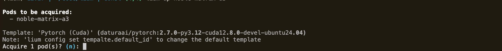

# 𖡼𖤣𖥧𖡼𓋼𖤣𖥧𓋼𓍊 Lium 𖡼𖤣𖥧𖡼𓋼𖤣𖥧𓋼𓍊

List, launch, and manage high-performance GPU executors from your terminal from [celium](https://celiumcompute.ai).

### 1. Installation

Make sure you have uv and Python 3.10+ installed.

```bash
git clone git@github.com:unconst/lium.git
cd lium
uv venv 
source .venv/bin/activate
uv pip install -e .
```

### 2. Get Your API Key

You'll need an API key from [CeliumCompute.ai](https://celiumcompute.ai). 

1.  Sign up or log in to your CeliumCompute account.
2.  Navigate to your API key settings (usually in your account or profile section).
3.  Generate or copy your API key.
4.  Fund your account with TAO or Visa on Celium.

### 3. Configure Lium CLI

Set your API key and path to your SSH key. This key will be automatically added to new pods you create, allowing you to SSH in.
```bash
lium config set api_key YOUR_API_KEY_HERE
lium config set ssh.key_path ~/.ssh/id_rsa
lium config show
```

## 4. Usage

**1. Lium ls**
```bash
# List all available H100s for rental
lium ls H100
```


**2. Lium up**
Acquries a pod with the default template image.
```bash
# Rent pod with name "golden-pixel-2f"
lium up noble-matrix-a3

# Rent multiple pods
lium up golden-pixel-2f, calm-jaguar-f6`
```
> NOTE: to set the image you want to load onto your pod use `lium config set template.default_id`


**3. Lium ps**
Show actively rented pods.
```bash
# Show all actively rented pods and their status
lium ps
```


**4. Lium Exec**
Executes a command on your running pod.
```bash
# Get the python version on a pod:
lium exec cosmic-raven-39 "python --version"
```


**5. Lium down**
Releases the acquired Pod.
```bash
# Release your rental on a pod golden-pixel-2f
lium down golden-pixel-2f

# Release all rentals without confirmation
lium down --all -y
```


## 📜 License

2025 Yuma Rao

Permission is hereby granted, free of charge, to any person obtaining a copy of this software and associated documentation files (the “Software”), to deal in the Software without restriction, including without limitation the rights to use, copy, modify, merge, publish, distribute, sublicense, and/or sell copies of the Software, and to permit persons to whom the Software is furnished to do so, subject to the following conditions:
The above copyright notice and this permission notice shall be included in all copies or substantial portions of the Software.
THE SOFTWARE IS PROVIDED “AS IS”, WITHOUT WARRANTY OF ANY KIND, EXPRESS OR IMPLIED, INCLUDING BUT NOT LIMITED TO THE WARRANTIES OF MERCHANTABILITY, FITNESS FOR A PARTICULAR PURPOSE AND NONINFRINGEMENT. IN NO EVENT SHALL THE AUTHORS OR COPYRIGHT HOLDERS BE LIABLE FOR ANY CLAIM, DAMAGES OR OTHER LIABILITY, WHETHER IN AN ACTION OF CONTRACT, TORT OR OTHERWISE, ARISING FROM, OUT OF OR IN CONNECTION WITH THE SOFTWARE OR THE USE OR OTHER DEALINGS IN THE SOFTWARE.
